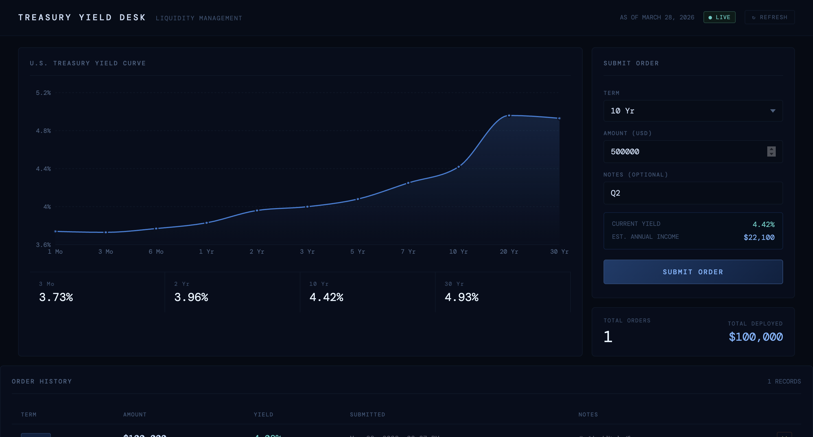

# Treasury Yield App

A full-stack bank liquidity management tool that plots the U.S. Treasury yield curve and lets users submit and track Treasury orders.



---

## Features

- **Live Yield Curve** — fetches data from the U.S. Treasury XML feed, falls back to FRED (St. Louis Fed) if unavailable, then to representative static data as a final fallback. Source is labeled in the UI (LIVE / FRED / STATIC).
- **Interactive Chart** — area chart of the full yield curve with hover tooltips; flags inverted curve conditions.
- **Order Submission** — pick a term, enter an amount; the app previews current yield and estimated annual income before you submit.
- **Order History** — all submitted orders persisted in SQLite, shown in a table with term, amount, locked-in yield, timestamp, and notes.
- **Delete Orders** — remove any order from history.

---

## Tech Stack

| Layer    | Technology                    |
|----------|-------------------------------|
| Backend  | Python · FastAPI · SQLite · httpx |
| Frontend | React · Recharts              |
| Data     | US Treasury XML API → FRED CSV → static fallback |

---

## Prerequisites

- **Python 3.10+**
- **Node.js 18+** and **npm**

---

## Quick Start

### 1. Clone the repo

```bash
git clone https://github.com/sabrinakdhaliwal/modernfi.git
cd modernfi
```

---

### 2. Start the Backend

```bash
cd backend
pip install -r requirements.txt
uvicorn main:app --reload --port 8000
```

The API will be live at `http://localhost:8000`.  
Interactive docs: `http://localhost:8000/docs`

---

### 3. Start the Frontend

In a new terminal:

```bash
cd frontend
npm install
npm start
```

The app will open at `http://localhost:3000`.

> The frontend proxies `/api/*` requests to `http://localhost:8000` automatically (configured via `"proxy"` in `package.json`).

---

## API Reference

| Method | Endpoint | Description |
|--------|----------|-------------|
| `GET` | `/api/yields` | Latest yield curve + valid terms |
| `GET` | `/api/orders` | All historical orders (newest first) |
| `POST` | `/api/orders` | Submit a new order |
| `DELETE` | `/api/orders/:id` | Delete an order |
| `GET` | `/health` | Health check |

### POST `/api/orders` body

```json
{
  "term": "10 Yr",
  "amount": 5000000,
  "notes": "Q2 liquidity buffer"
}
```

---

## Project Structure

```
modernfi/
├── backend/
│   ├── main.py          # FastAPI app — yields, orders, SQLite
│   ├── requirements.txt
│   └── orders.db        # Created automatically on first run
├── frontend/
│   ├── public/
│   │   └── index.html
│   ├── src/
│   │   ├── App.js       # Main dashboard component
│   │   └── index.js
│   └── package.json
└── README.md
```

---

## Data Sources

1. **US Treasury** — `https://home.treasury.gov/.../xml?data=daily_treasury_yield_curve` (official, real-time)
2. **FRED** — `https://fred.stlouisfed.org/graph/fredgraph.csv` per maturity series (fallback, no API key needed)
3. **Static** — representative March 2026 curve hardcoded as a final fallback

The UI always shows which source is active.

---

## Notes

- Orders are stored in `backend/orders.db` (SQLite). Delete this file to reset history.
- No authentication is included — this is a prototype/take-home scope.
- For a production deployment you'd want to add auth, rate limiting, a proper database, and a caching layer for yield data.

---

## Tradeoffs & Design Decisions

### Backend: FastAPI + SQLite

FastAPI was a natural starting point for me — it's fast to spin up, handles
request validation automatically via Pydantic, and generates interactive API
docs at `/docs` without any extra configuration. For a 4-6 hour scope that
felt like the right call over Flask, which would've needed more manual wiring
for the same result.

SQLite was a deliberate prototype choice. No server to configure, no
migrations to run — it's just a file. The tradeoff is that SQLite struggles
with concurrent writes, so in a real production system I'd swap it for
Postgres. I'd also add a connection pool and proper migration tooling
(something like Alembic).

### Data Fetching: Fallback Chain

The app tries three sources in order: the official US Treasury XML feed, then
FRED (St. Louis Fed), then static representative data. The UI always shows
which source is active. The main tradeoff here is that I'm making a live
HTTP call on every `/api/yields` request — in production I'd cache that
response for something like 15-30 minutes since yield data doesn't move
second-to-second, and hitting a government XML endpoint on every page load
isn't great.

### Frontend: React + Recharts

React made sense given the interactive state (form, chart, order history all
updating together). Recharts got me a working area chart quickly — it's
React-native and composable. The honest tradeoff is I'd look at D3 for
anything more custom, since Recharts abstracts away control that you
eventually want back.

The bigger thing I'd change with more time is componentization. Right now
App.js is doing too much — the chart, the order form, and the history table
are all in one file. I'd pull those into separate components, add prop types
or TypeScript, and write at least basic unit tests for the order submission
flow.

### What I'd Add With More Time

- **Auth** — right now anyone can submit or delete orders. Even a simple
  JWT-based login would make this closer to production-ready.
- **Postgres** — replace SQLite for concurrent access and proper query support.
- **Yield caching** — a short TTL cache on the backend so we're not hitting
  Treasury or FRED on every request.
- **Historical curve comparison** — the most interesting financial feature
  would be overlaying today's curve against curves from 3/6/12 months ago
  to visualize how the curve has shifted. That's where the real liquidity
  story lives.
